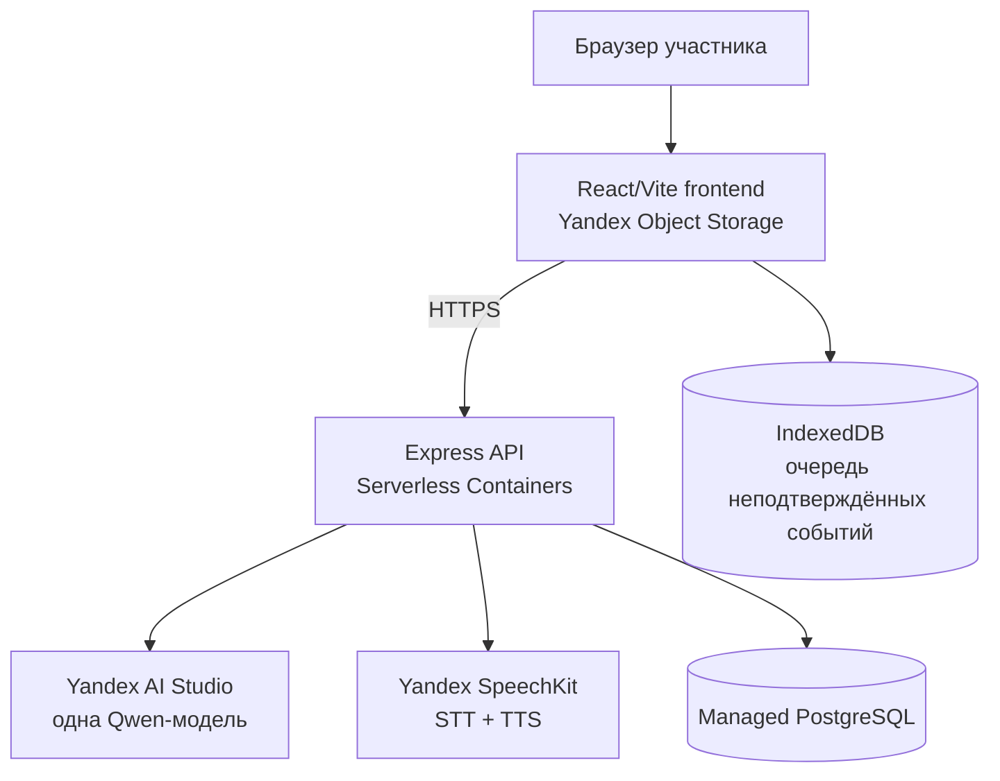

# VoiceTutor

VoiceTutor — экспериментальный стенд для исследования эффективности голосового интерфейса в образовательном веб-приложении при решении авторских задач формата ЕГЭ по информатике. Исследование сравнивает интерфейсы `voice` и `text`, а не модели: оба условия используют одну LLM, один серверный system prompt и одинаковые параметры генерации.

Наборы A/B являются кандидатами для пилота; их равносложность ещё не установлена. Результаты выполнения с тьютором сами по себе не являются измерением усвоения знаний.

## Архитектура



Frontend: React 19, TypeScript, Vite, Zustand, Monaco Editor и Pyodide WebWorker. Backend: Node.js 20, Express 5 и `pg`. Системный prompt находится в `server/src/llm/prompt.ts`; модель задаётся только через `LLM_MODEL`. Аудио записывается одной репликой, преобразуется в mono PCM 16 kHz, отправляется в SpeechKit и не сохраняется приложением.

## Режимы

- `text`: ввод вопроса → AI Studio → текстовый ответ.
- `voice`: запись → SpeechKit STT → подтверждаемый текст → та же AI Studio LLM → тот же текстовый ответ → SpeechKit TTS → воспроизведение.

Назначение режима и набора фиксируется схемой сессии. Доступны четыре порядка: text/A→voice/B, voice/A→text/B, text/B→voice/A, voice/B→text/A.

## Локальный запуск

Требуются Node.js 20+, Docker для локального PostgreSQL и ключ сервисного аккаунта Yandex Cloud с доступом к AI Studio, SpeechKit STT и TTS.

```bash
npm install
npm --prefix server install
cp .env.example .env
cp server/.env.example server/.env
```

Заполните `server/.env`. Поднимите PostgreSQL, примените миграцию и запустите API:

```bash
docker compose up -d postgres
npm --prefix server run db:migrate
npm run dev:server
```

Во втором терминале:

```bash
npm run dev
```

Откройте `http://localhost:5173/#/experiment`. Вариант целиком в контейнерах: `docker compose up --build`; API-контейнер автоматически запускает миграцию.

## Environment variables

### Frontend

| Переменная | Назначение |
|---|---|
| `VITE_API_URL` | Публичный HTTPS URL backend; не должен быть localhost в production |
| `VITE_BASE_PATH` | Base path статики, обычно `/` |

### Backend

| Переменная | Назначение |
|---|---|
| `DATABASE_URL` | PostgreSQL connection string |
| `DATABASE_SSL` | `true` для TLS-подключения к Managed PostgreSQL |
| `YANDEX_CLOUD_FOLDER_ID` | Folder ID Yandex Cloud |
| `YANDEX_CLOUD_API_KEY` | API key сервисного аккаунта; только backend/Lockbox |
| `LLM_MODEL` | Полный URI модели, например `gpt://<folder>/<model-id>/latest`; фактический ID выбрать в Model Gallery |
| `LLM_TEMPERATURE` | Фиксированная температура |
| `LLM_MAX_TOKENS` | Фиксированный предел ответа |
| `SPEECHKIT_STT_MODEL` | Модель распознавания, по умолчанию `general` |
| `SPEECHKIT_TTS_VOICE` | Голос синтеза |
| `EXPERIMENT_VERSION` | Версия методики, например `2026-09-v1` |
| `SYSTEM_PROMPT_VERSION` | Версия server-side prompt |
| `FRONTEND_ORIGIN` / `ALLOWED_ORIGINS` | Разрешённые CORS origins |
| `ALLOWED_PARTICIPANT_CODES` | Выданные исследователем анонимные коды |
| `SESSION_SECRET` | HMAC secret сессий |
| `RESEARCHER_SECRET` | Secret researcher-only экспорта |
| `PORT` | Порт API, передаётся Serverless Containers |

## Миграции и данные

```bash
npm --prefix server run db:migrate
```

Миграция `server/migrations/001_initial.sql` создаёт `experiment_sessions`, `experiment_events`, `messages`, `llm_requests`, `voice_events`, `task_results` и `ui_events`. `experiment_events` — полная воспроизводимая запись; остальные таблицы — удобные аналитические проекции. Дубликаты исключаются первичным ключом `event_id`.

Клиент сначала пишет событие в IndexedDB и удаляет его из очереди только после подтверждения PostgreSQL-backed API. Аудиофайлы и IP-адреса в экспериментальные таблицы не записываются.

Researcher export требует `Authorization: Bearer researcher:<RESEARCHER_SECRET>`:

- `/api/export/all` — полный JSON;
- `/api/export/events.csv`;
- `/api/export/sessions.csv`;
- `/api/export/task_attempts.csv`;
- `/api/export/questionnaire.csv`.

## Проверки

```bash
npm run lint
npm run build
npm --prefix server test
VITE_API_URL=https://<container-id>.containers.yandexcloud.net npm run build:production
docker build -t voicetutor-api ./server
```

## Развёртывание в Yandex Cloud

Ниже используются placeholders; команды не создают платные ресурсы автоматически.

```bash
yc container registry create --name voicetutor
docker tag voicetutor-api cr.yandex/<REGISTRY_ID>/voicetutor-api:<VERSION>
docker push cr.yandex/<REGISTRY_ID>/voicetutor-api:<VERSION>
yc serverless container create --name voicetutor-api
```

Создайте ревизию контейнера в консоли или CLI, передав образ, service account, VPC и environment/Lockbox secrets. `DATABASE_URL` должен указывать на Managed PostgreSQL; перед первым запуском выполните миграцию из доверенного окружения либо одноразовой ревизией с командой `node dist/db/migrate.js`.

Frontend:

```bash
VITE_API_URL=https://<API_HOST> VITE_BASE_PATH=/ npm run build:production
aws --endpoint-url=https://storage.yandexcloud.net s3 sync dist/ s3://<BUCKET>/ --delete
```

Bucket настраивается как HTTPS static website. Маршрутизация использует hash (`#/experiment`), поэтому server-side SPA fallback не требуется. Микрофон в production требует HTTPS.

Подробности исследования: [протокол](docs/experiment-protocol.md), [словарь данных](docs/data-dictionary.md), [чек-лист пилота](docs/pilot-checklist.md).
